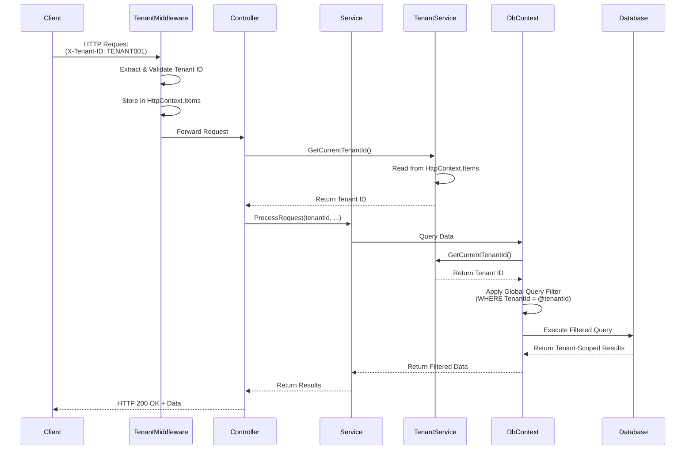
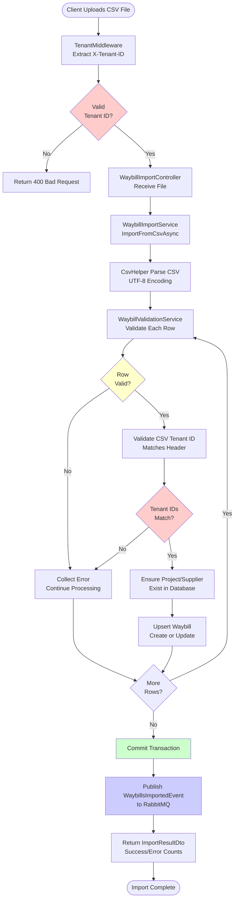
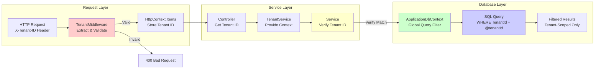
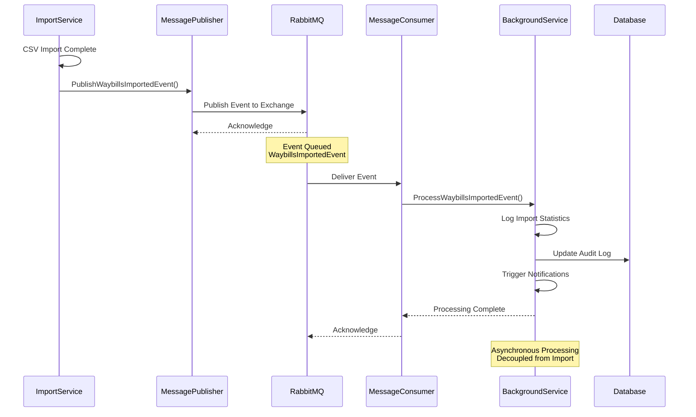
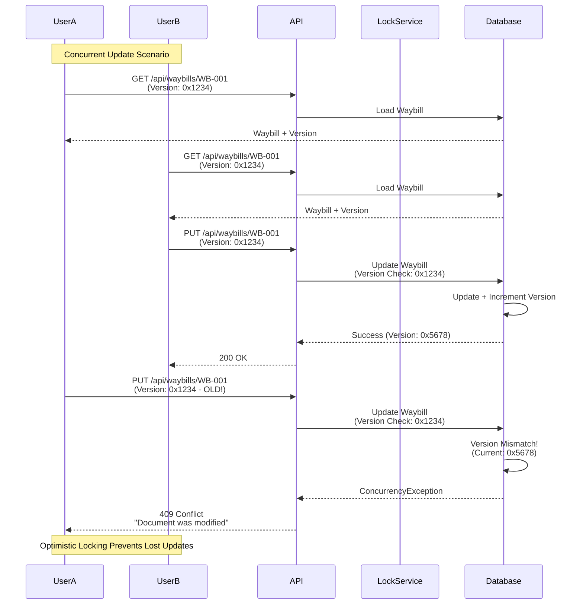
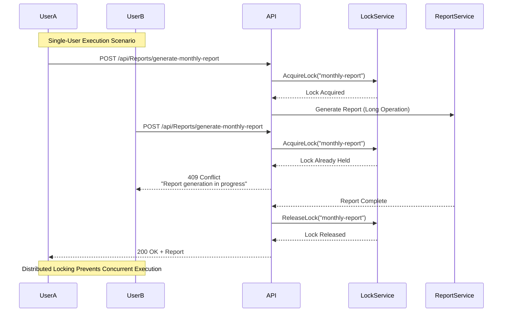
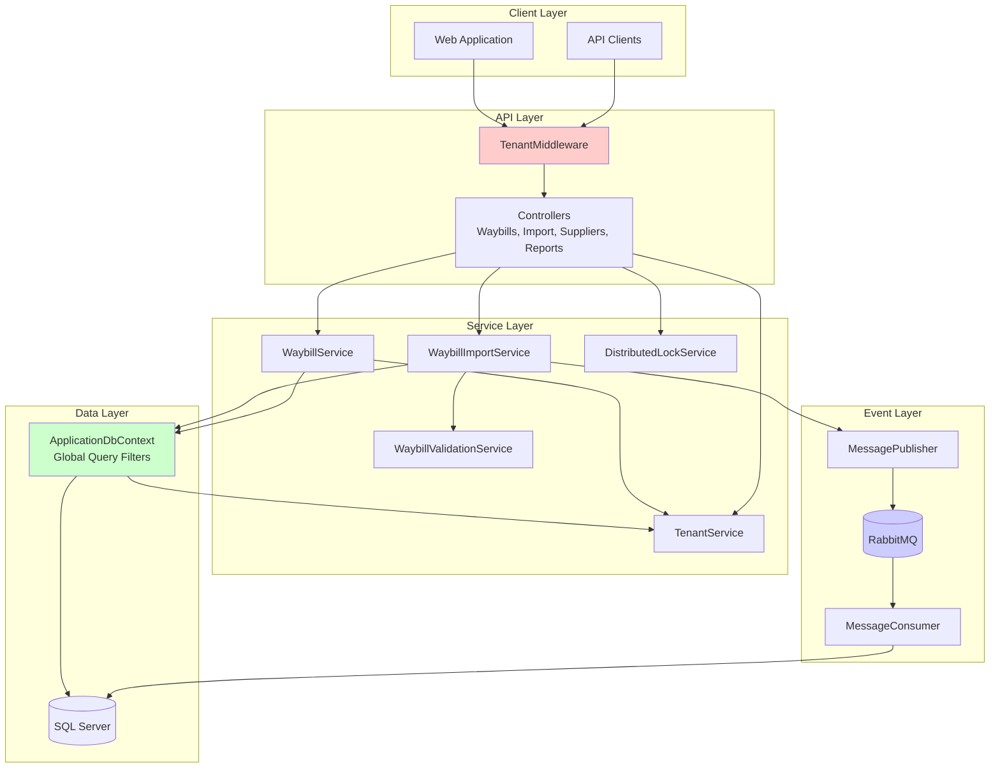
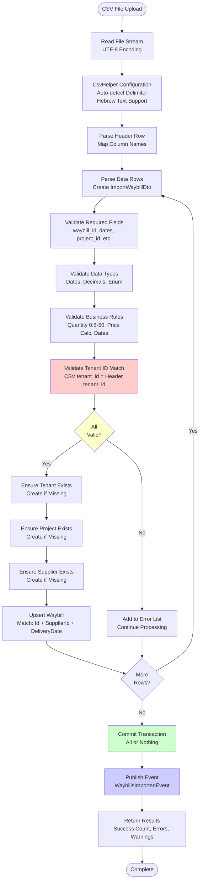

# Waybill Management System - Architecture Diagrams

This document contains Mermaid diagrams visualizing the system architecture, data flows, and component interactions.

## 1. Request Flow Diagram

This diagram shows the complete lifecycle of an HTTP request through the system, including tenant resolution at each layer.



## 2. CSV Import Flow Diagram

This diagram shows the complete CSV import pipeline from file upload to database persistence and event publishing.



## 3. Multi-Tenant Isolation Flow

This diagram demonstrates how tenant isolation is enforced at multiple layers (defense-in-depth).



## 4. Event-Driven Architecture Flow

This diagram shows how events flow through RabbitMQ for asynchronous processing.



## 5. Concurrency Handling Flow

This diagram shows how optimistic locking and distributed locking prevent race conditions.





## 6. Database Schema Relationships

This diagram shows the entity relationships and tenant isolation strategy.

```mermaid
erDiagram
    TENANT ||--o{ PROJECT : "has"
    TENANT ||--o{ SUPPLIER : "has"
    TENANT ||--o{ WAYBILL : "has"
    
    PROJECT ||--o{ WAYBILL : "contains"
    SUPPLIER ||--o{ WAYBILL : "delivers"
    
    TENANT {
        string Id PK
        string Name
        DateTime CreatedAt
    }
    
    PROJECT {
        string Id PK
        string TenantId FK
        string Name
        DateTime CreatedAt
    }
    
    SUPPLIER {
        string Id PK
        string TenantId PK
        string Name
        DateTime CreatedAt
    }
    
    WAYBILL {
        string Id PK
        string TenantId FK
        string ProjectId FK
        string SupplierId FK
        date WaybillDate
        date DeliveryDate
        decimal Quantity
        decimal TotalAmount
        int Status
        byte[] Version
        DateTime CreatedAt
        DateTime UpdatedAt
    }
    
    Note right of SUPPLIER: Composite Primary Key<br/>(TenantId, Id)<br/>Allows same supplier ID<br/>across tenants
```

## 7. Component Interaction Diagram

This diagram shows how all major components interact in the system.



## 8. CSV Processing Pipeline Detail

Detailed view of CSV import processing steps.



## Key Architectural Decisions

### 1. Global Query Filters
**Decision**: Use EF Core global query filters for tenant isolation
**Rationale**: Automatic filtering at database level prevents accidental cross-tenant queries
**Trade-off**: Slightly more complex DbContext setup, but provides defense-in-depth security

### 2. Composite Primary Key for Suppliers
**Decision**: Use (TenantId, Id) composite key for Supplier entity
**Rationale**: Allows different tenants to have suppliers with same ID (e.g., shared suppliers)
**Trade-off**: More complex foreign key relationships, but enables realistic multi-tenant scenarios

### 3. Event-Driven Architecture
**Decision**: Use RabbitMQ for asynchronous event processing
**Rationale**: Decouples import processing from downstream actions (notifications, statistics)
**Trade-off**: Additional infrastructure, but enables scalability and flexibility

### 4. In-Memory Distributed Locking
**Decision**: Start with in-memory locking, upgradeable to Redis
**Rationale**: Simple for single-instance deployment, can upgrade to Redis for multi-instance
**Trade-off**: Doesn't work across multiple API instances, but sufficient for assignment scope

### 5. String Enum Serialization
**Decision**: Use JsonStringEnumConverter for API enum serialization
**Rationale**: More readable API responses, easier frontend integration
**Trade-off**: Slightly larger JSON payloads, but better developer experience
