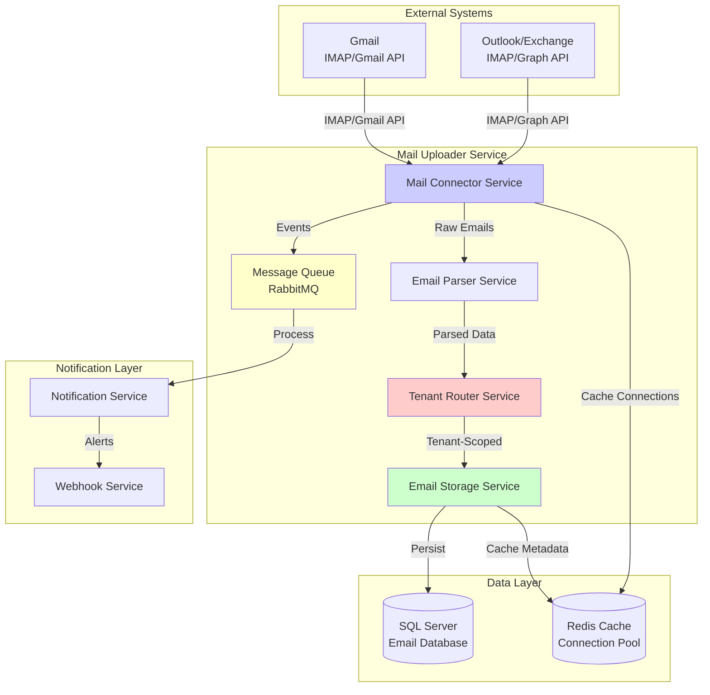
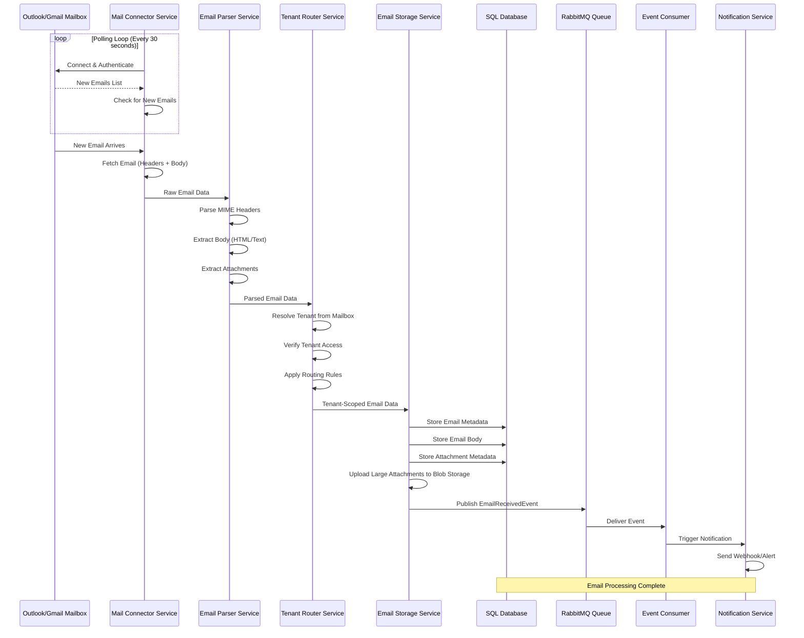
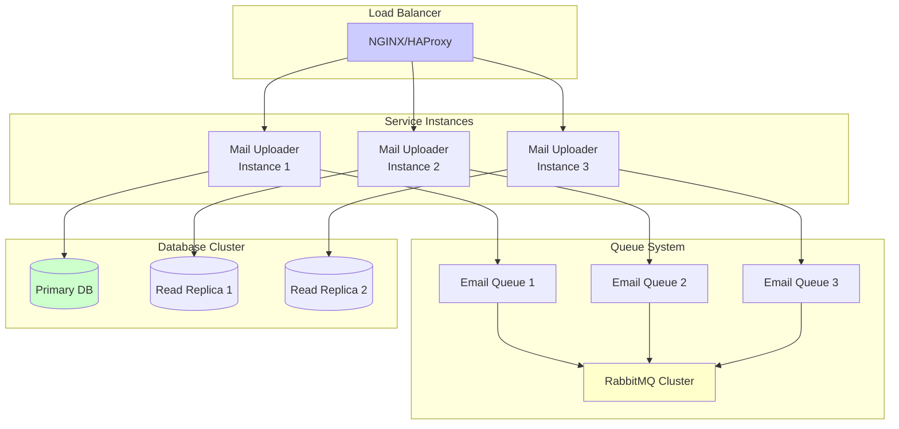
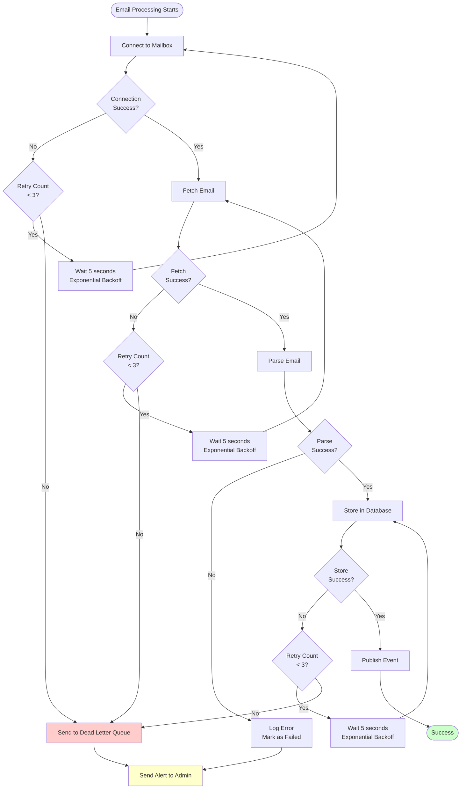
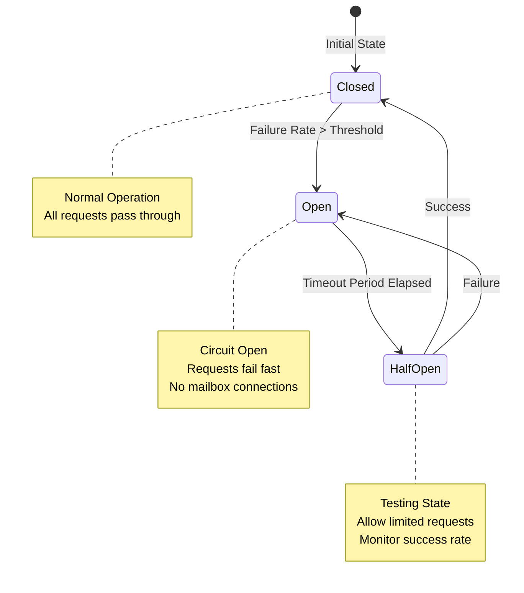

# Mail Uploader Service - Architecture Design

## Overview

This document presents the architectural design for a Mail Uploader Service that connects to Outlook/Gmail mailboxes, reads incoming emails and attachments, stores email metadata and content in SQL database, handles medium to high load (thousands of emails per hour), and supports multiple tenants (each tenant has their own mailboxes).

## Requirements

- Connect to Outlook/Gmail mailboxes (multiple accounts)
- Read incoming emails and attachments
- Store email metadata and content in SQL database
- Handle medium to high load (thousands of emails per hour)
- Support multiple tenants (each tenant has their own mailboxes)

## High-Level Architecture Diagram



## Component Diagram

```mermaid
graph LR
    subgraph MailConnectorService[Mail Connector Service]
        IMAPConnector[IMAP Connector<br/>Outlook/Gmail]
        GraphConnector[Graph API Connector<br/>Outlook]
        GmailConnector[Gmail API Connector<br/>Gmail]
        ConnectionPool[Connection Pool Manager]
        AuthManager[Authentication Manager<br/>OAuth2/App Passwords]
    end
    
    subgraph EmailParserService[Email Parser Service]
        MimeParser[MIME Parser<br/>Parse Headers/Body]
        AttachmentExtractor[Attachment Extractor<br/>Extract Files]
        HtmlParser[HTML Parser<br/>Extract Text]
        TextExtractor[Text Extractor<br/>Plain Text]
    end
    
    subgraph TenantRouterService[Tenant Router Service]
        TenantResolver[Tenant Resolver<br/>Map Mailbox → Tenant]
        IsolationEnforcer[Isolation Enforcer<br/>Verify Tenant Access]
        RoutingRules[Routing Rules Engine<br/>Custom Routing Logic]
    end
    
    subgraph EmailStorageService[Email Storage Service]
        MetadataStore[Metadata Store<br/>Email Headers/Info]
        ContentStore[Content Store<br/>Body/Attachments]
        BlobStorage[Blob Storage<br/>Large Attachments]
        AuditLogger[Audit Logger<br/>Track Operations]
    end
    
    subgraph NotificationService[Notification Service]
        EventPublisher[Event Publisher<br/>RabbitMQ]
        AlertManager[Alert Manager<br/>Send Alerts]
        WebhookSender[Webhook Sender<br/>HTTP Callbacks]
    end
    
    IMAPConnector --> MimeParser
    GraphConnector --> MimeParser
    GmailConnector --> MimeParser
    
    MimeParser --> AttachmentExtractor
    MimeParser --> HtmlParser
    MimeParser --> TextExtractor
    
    AttachmentExtractor --> TenantResolver
    HtmlParser --> TenantResolver
    TextExtractor --> TenantResolver
    
    TenantResolver --> IsolationEnforcer
    IsolationEnforcer --> RoutingRules
    
    RoutingRules --> MetadataStore
    RoutingRules --> ContentStore
    ContentStore --> BlobStorage
    
    MetadataStore --> EventPublisher
    ContentStore --> EventPublisher
    EventPublisher --> AlertManager
    AlertManager --> WebhookSender
    
    ConnectionPool --> IMAPConnector
    ConnectionPool --> GraphConnector
    ConnectionPool --> GmailConnector
    AuthManager --> ConnectionPool
    
    style TenantResolver fill:#ffcccc
    style IsolationEnforcer fill:#ffcccc
    style MetadataStore fill:#ccffcc
    style EventPublisher fill:#ffffcc
```



## Data Flow Diagram



## Database Schema Design

```mermaid
erDiagram
    TENANT ||--o{ MAILBOX : "has"
    TENANT ||--o{ EMAIL : "has"
    MAILBOX ||--o{ EMAIL : "receives"
    EMAIL ||--o{ ATTACHMENT : "has"
    EMAIL ||--o{ EMAIL_ROUTING_RULE : "matches"
    
    TENANT {
        string Id PK
        string Name
        datetime CreatedAt
    }
    
    MAILBOX {
        string Id PK
        string TenantId FK
        string EmailAddress
        string ProviderType "Outlook/Gmail"
        string ConnectionString "Encrypted"
        string AuthToken "Encrypted"
        datetime LastSyncAt
        int Status "Active/Inactive/Error"
    }
    
    EMAIL {
        string Id PK "Message-ID"
        string TenantId FK
        string MailboxId FK
        string FromAddress
        string ToAddress
        string Subject
        string BodyText
        string BodyHtml
        datetime ReceivedAt
        datetime ProcessedAt
        int Status "New/Processed/Failed"
        string RoutingRuleId FK "Nullable"
    }
    
    ATTACHMENT {
        string Id PK
        string EmailId FK
        string FileName
        string ContentType
        long FileSize
        string BlobStoragePath "Nullable"
        byte[] Content "Nullable - Small Files"
        datetime CreatedAt
    }
    
    EMAIL_ROUTING_RULE {
        string Id PK
        string TenantId FK
        string Name
        string Condition "JSON"
        string Action "JSON"
        int Priority
        bool IsActive
    }
    
    Note right of MAILBOX: Tenant-Scoped Mailboxes\nEach tenant has their own mailboxes\nEncrypted credentials stored securely
    
    Note right of EMAIL: Tenant Isolation\nAll emails scoped to tenant\nGlobal query filter enforces isolation
    
    Note right of ATTACHMENT: Blob Storage for Large Files\nSmall attachments in database\nLarge attachments in blob storage
```

### Database Tables

#### Tenants
- **Id** (PK): Unique tenant identifier
- **Name**: Tenant display name
- **CreatedAt**: Audit timestamp

#### Mailboxes
- **Id** (PK): Unique mailbox identifier
- **TenantId** (FK): Reference to Tenant
- **EmailAddress**: Email address of the mailbox
- **ProviderType**: "Outlook" or "Gmail"
- **ConnectionString**: Encrypted connection details
- **AuthToken**: Encrypted OAuth token or app password
- **LastSyncAt**: Last successful sync timestamp
- **Status**: Active, Inactive, or Error

#### Emails
- **Id** (PK): Message-ID from email header
- **TenantId** (FK): Reference to Tenant (for isolation)
- **MailboxId** (FK): Reference to Mailbox
- **FromAddress**: Sender email address
- **ToAddress**: Recipient email address
- **Subject**: Email subject
- **BodyText**: Plain text body
- **BodyHtml**: HTML body
- **ReceivedAt**: When email was received
- **ProcessedAt**: When email was processed
- **Status**: New, Processed, or Failed
- **RoutingRuleId** (FK, nullable): Matched routing rule

#### Attachments
- **Id** (PK): Unique attachment identifier
- **EmailId** (FK): Reference to Email
- **FileName**: Original filename
- **ContentType**: MIME type
- **FileSize**: Size in bytes
- **BlobStoragePath**: Path in blob storage (for large files)
- **Content**: Binary content (for small files < 1MB)
- **CreatedAt**: Audit timestamp

#### EmailRoutingRules
- **Id** (PK): Unique rule identifier
- **TenantId** (FK): Reference to Tenant
- **Name**: Rule name
- **Condition**: JSON condition (e.g., `{"from": "example.com", "subject": "Invoice"}`)
- **Action**: JSON action (e.g., `{"routeTo": "invoices", "notify": true}`)
- **Priority**: Rule priority (higher = evaluated first)
- **IsActive**: Whether rule is active

### Indexes

- **Mailboxes**: `TenantId`, `EmailAddress`, `Status`
- **Emails**: `TenantId`, `MailboxId`, `ReceivedAt`, `Status`, `(TenantId, ReceivedAt)` (composite)
- **Attachments**: `EmailId`, `FileName`
- **EmailRoutingRules**: `TenantId`, `IsActive`, `Priority`

## Scaling Strategy

### Horizontal Scaling

1. **Multiple Service Instances**: Deploy multiple Mail Uploader Service instances behind a load balancer
2. **Queue-Based Distribution**: Use RabbitMQ to distribute email processing across instances
3. **Database Partitioning**: Partition emails table by TenantId or date range
4. **Blob Storage**: Use distributed blob storage (Azure Blob Storage, AWS S3) for attachments

### Load Distribution



### Caching Strategy

1. **Connection Pool Caching**: Cache mailbox connections in Redis to avoid re-authentication
2. **Metadata Caching**: Cache frequently accessed email metadata (last 24 hours)
3. **Routing Rules Caching**: Cache routing rules per tenant in Redis
4. **TTL Strategy**: 
   - Connection pools: 30 minutes
   - Metadata: 5 minutes
   - Routing rules: 1 hour

### Database Optimization

1. **Partitioning**: Partition emails table by date (monthly partitions)
2. **Archiving**: Move old emails (> 1 year) to archive tables
3. **Read Replicas**: Use read replicas for query-heavy operations
4. **Indexing**: Strategic indexes on TenantId, ReceivedAt, Status

## Failure Handling

### Retry Mechanisms



### Dead Letter Queue

- **Purpose**: Store emails that failed processing after all retries
- **Retention**: 30 days
- **Monitoring**: Alert administrators when DLQ size exceeds threshold
- **Recovery**: Manual review and reprocessing of failed emails

### Circuit Breaker Pattern



### Data Consistency Guarantees

1. **Transactional Processing**: Use database transactions for email + attachments storage
2. **Idempotency**: Use Message-ID as unique constraint to prevent duplicate processing
3. **Eventual Consistency**: Email processing is eventually consistent (async processing)
4. **Audit Trail**: All operations logged for audit and recovery

### Monitoring and Alerting

1. **Health Checks**: Monitor service health, database connectivity, queue depth
2. **Metrics**: Track processing rate, error rate, latency, queue depth
3. **Alerts**: 
   - High error rate (> 5%)
   - Queue depth exceeds threshold (> 1000)
   - Database connection failures
   - Dead letter queue growth
4. **Dashboards**: Real-time monitoring dashboards (Grafana, Application Insights)

## Security Considerations

1. **Credential Encryption**: All mailbox credentials encrypted at rest (AES-256)
2. **OAuth2**: Use OAuth2 for Outlook/Gmail authentication (no password storage)
3. **Tenant Isolation**: Global query filters ensure tenant data isolation
4. **Access Control**: Role-based access control for mailbox management
5. **Audit Logging**: All mailbox access logged for security auditing

## Performance Targets

- **Throughput**: 1000+ emails per hour per instance
- **Latency**: < 5 seconds from email arrival to storage
- **Availability**: 99.9% uptime (8.76 hours downtime per year)
- **Scalability**: Linear scaling with additional instances

## Technology Stack Recommendations

- **.NET 10**: Backend service framework
- **IMAP Library**: MailKit for IMAP connections
- **Graph API**: Microsoft Graph SDK for Outlook
- **Gmail API**: Google.Apis.Gmail for Gmail
- **RabbitMQ**: Message queue for async processing
- **SQL Server**: Primary database
- **Redis**: Caching and connection pooling
- **Azure Blob Storage / AWS S3**: Large attachment storage
- **Serilog**: Structured logging
- **Application Insights / Prometheus**: Monitoring and metrics
